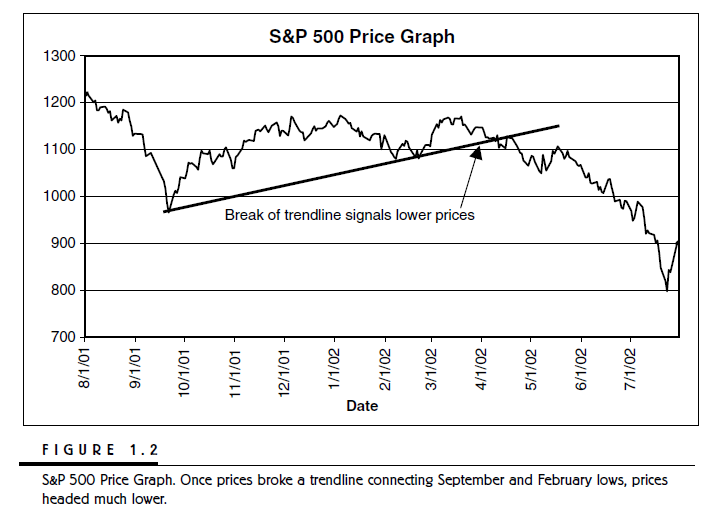

**科学bent和量化交易**

**你** 也许会问，每个月有大量的关于交易系统和方法的书问世，为什么选此书？我必须说《量化交易策略》这本书是独特的，因为是我通过展现现实与逻辑的方法，将量化分析引入到主流中。

**当** 大多数市面上的书鼓吹一个特殊的交易方法，他们常常会没有历史回测数据以支持他们的想法，同时也没有和其他方法的对比。在本书，我会将新老方法在一个投资组合市场中一同测试并对比。当其他书籍只是聚焦在股票和期货市场的时候，我将量化交易策略引入到所有市场。

**我** 们将在期货，股票以及新兴市场使用我们的技术，某些市场读者可能不太熟悉；同时，我们会针对当下时兴的交易系统以及我在过去15年交易中得到的点子做历史回测。这些回测覆盖广泛，它们包括29中农产品，34支股票和股指，和30个相关市场；以及过去12年以天为周期的价格数据。我们将从不同的角度检验历史回测的性能。

**此** 外，我将指导读者重新创造我的结果，并且创造，测试和评估交易系统的优劣。并且，我将展示我过去交易中使用到的量化分析方法和工具的好处和局限。同时，按照我个人经验，我将提及一些个人职业生涯中的轶事。

**通** 过图表展示量化交易方法的赢利非常重要，但是讨论方法的局限性也同等重要。没有任何交易者每天都在赚钱，极少有交易者每个月都在赚钱；一些能够在过去赚钱的策略在未来可能会赔钱。量化策略交易涉及诸多风险，但是这些风险我们希望能够通过使用最先进的技术设计，测试和交易来降低风险。

**读** 者可能会注意到，我一直不断提及使用基于历史价格回测的固定的规则在市场做交易被称之为*量化交易*，而不是业界典型使用的流行词汇--技术分析；他们之间的区别是分析的力度。我承认我曾经鄙视那些用图表解释历史数据走向的技术分析流。其中一个例子是画趋势线，或者最高点和最低点的连线（如图1.2）；他们的理论是，通过这些线的延长线就可以支持或者阻碍市场未来的走向。你可能经常听到老派技术流的如下陈述：
*陈述1*：标普500指数因为在1100这个六个月的趋势线被打破，所以下降了

图1.2

**上** 文的陈述本身其实并没有提供有效的交易信息。使用技术分析重组过去的市场行情没有任何意义。市场因为新闻和信息下跌。市场下跌的少部分原因是：公司的赢利下降，担心财务报表言过其实，作物产出过剩，终端用户的需求下降。当解释历史时，我们通常能够创建清晰的上涨下跌的市场因素。但是历史都是事后诸葛亮。

**我** 认为使用技术分析和图表解释历史市场的行为和技术分析可以帮助预测市场动向很傻；考虑如下无意义的陈述：

*陈述2*：6个月的均线突破会导致观望者进入市场并拉低价格。

**这** 个陈述有一个交易者可以用的优点。因为市场已经跌破之前的支撑，我们更相信短期的未来价格会更低。因此，我们平掉多头做空头。有经验的技术分析家通过判断市场行情主流来预测市场走向；并且将历史价格走向给那些基本面分析者们去剖析。

**对** 交易者来说，此陈述的第二个用处是；我们可以进一步的结合市场历史表现。 毕竟，我们能够确定趋势的突破就一定是市场进一步走低的前兆么？策略在历史回测上有多少次有效？考虑如下的陈述，它建议我们在某个市场点入市，这个市场点就是移动平均的交叉线。
